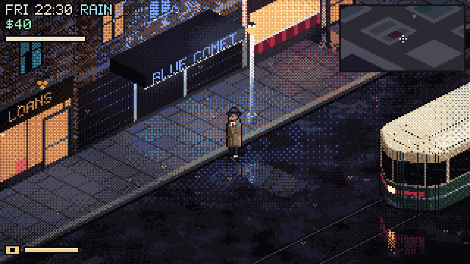
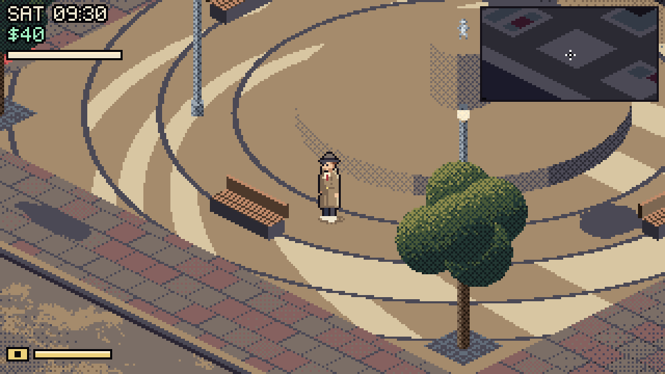
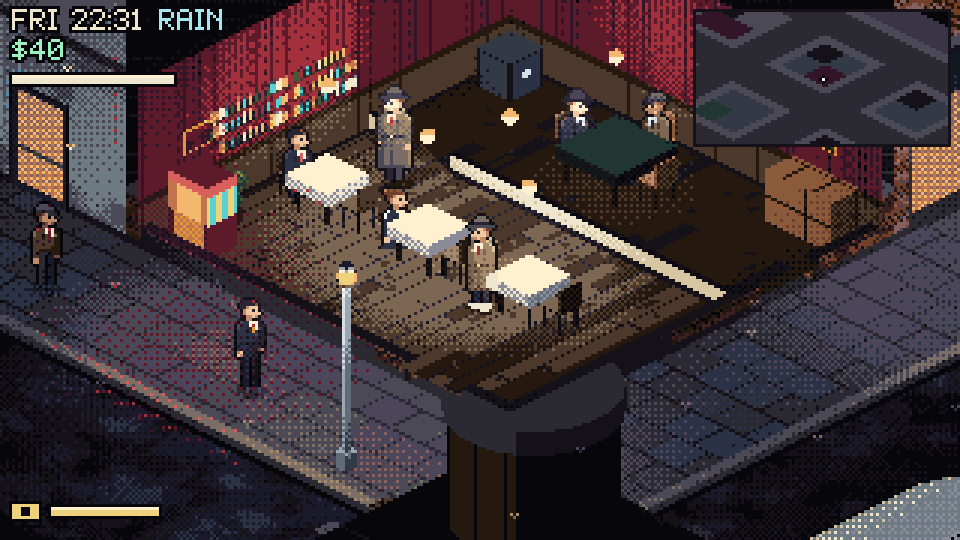
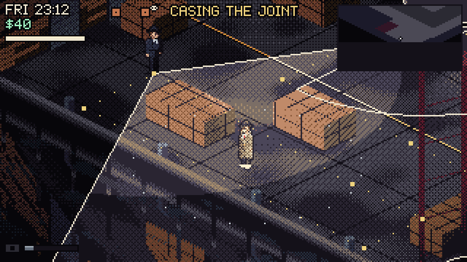
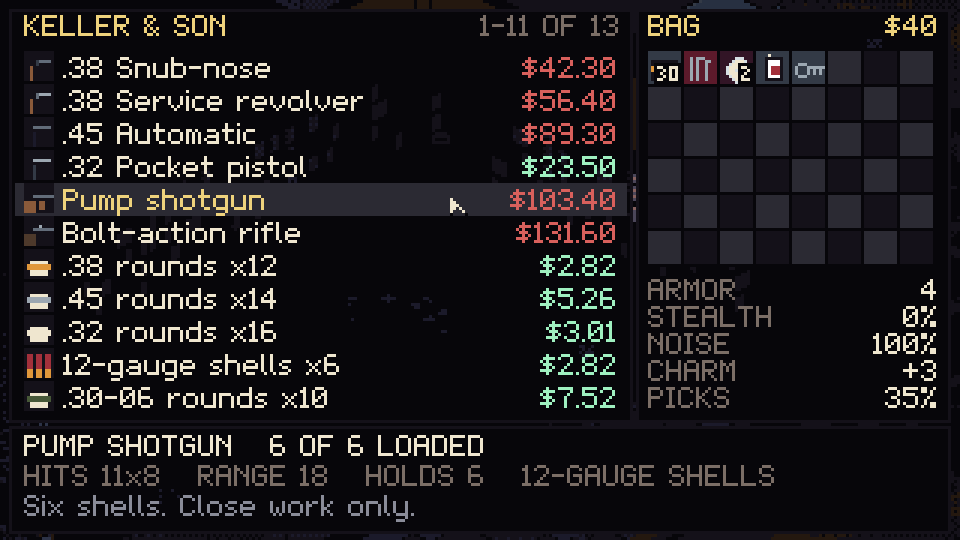

# PixelArtGameOpus

Noir pixel-art games in the browser. They are set in New Meridian in 1957 and follow detective Frank Calder.

Each game is a single self-contained HTML file. They use plain JavaScript and Canvas 2D, with no libraries, no image files and no audio files. Everything is drawn in code: every building, car, person, raindrop and letter of the font. The sound effects and music are synthesized at runtime.

| File | What it is |
|---|---|
| [`hourglass_city.html`](hourglass_city.html) | **The Hourglass City**, an isometric point-and-click adventure (Act I, *The Ordinary Dead*) |
| [`hourglass_testlevel.html`](hourglass_testlevel.html) | **The Black Sedan**, a real-time test level: take any car, chase the sedan, fight its crew at Pier 9 |
| [`hourglass_opencity.html`](hourglass_opencity.html) | **New Meridian**, an open-city test level: walk, drive, go inside, take jobs, sneak or shoot, by day and by night |
| [`ravenshore_garden.html`](ravenshore_garden.html) | **Ravenshore Garden**, a cinematic pixel-art loop |

## Play

**Play in your browser: https://odiriuss.github.io/PixelArtGameOpus/**

- [New Meridian](https://odiriuss.github.io/PixelArtGameOpus/hourglass_opencity.html) (the open city)
- [The Black Sedan](https://odiriuss.github.io/PixelArtGameOpus/hourglass_testlevel.html) (the car chase)
- [The Hourglass City](https://odiriuss.github.io/PixelArtGameOpus/hourglass_city.html) (the adventure)
- [Ravenshore Garden](https://odiriuss.github.io/PixelArtGameOpus/ravenshore_garden.html)

The games need a keyboard and mouse, so play them on a desktop or laptop. To play offline, download an HTML file and open it; you don't need to install anything or run a server.

## The Hourglass City


A 1950s detective adventure in the tradition of *Beneath a Steel Sky*. Frank's office, Ferrier Street, the Hotel Mirador, the Nickel Mile and the Blue Comet jazz club are all rendered in real time with lighting, rain and neon. Frank collects clues in his notebook and makes deductions from them.


**Mouse:** left click to walk, use, talk and pick up. Right click to look. Move to the top edge to open the inventory.
**Keyboard:** WASD or the arrow keys to walk, E or Space to use, Q to look, Tab for the next nearby thing, I for inventory, N for the notebook, 1–4 to pick dialogue, Esc for the menu.

The game saves at key moments, and you can also save from the Esc menu. *Continue* on the title screen resumes your game.

## The Black Sedan (test level)


A drive-by outside the Blue Comet starts a chase across the city.
- Take any parked car, or pull a driver out of a moving one. The sedan, coupe, taxi and delivery van all handle differently.
- Ram the sedan or shoot at it. Mind the streetcar and the harbour.
- The chase ends in a gunfight at Pier 9, or wherever you wreck their car. The crew use cover, flank you and pick their moments to shoot.


| | |
|---|---|
| On foot | WASD move, mouse aim, click to shoot, R reload, C crouch, E take a car |
| Driving | W gas, S brake/reverse, A/D steer, Space handbrake, click to shoot, E get out, H horn |
| Any time | F fire at the nearest target, Esc pause (R restarts the checkpoint), M sound |

Add these URL options to the file address: `?start=chase` or `?start=fight` jump to a checkpoint, `?god=1` makes Frank invincible, `?auto=1` lets a bot play it through, and `?debug=1` shows frame timings.

## New Meridian (open-city test level)



A sandbox slice of the city from the concept: twelve blocks of Downtown, the Nickel Mile and the South Docks to walk and drive around freely.
- **Inside.** Most buildings can be entered. The roof lifts off the one you are in, and the key places have upper floors up a flight of stairs.
- **Day and night.** A day passes in 24 minutes. Shops keep their hours, the lamps and the neon come on at dusk, and the traffic thins out at night.
- **Gear.** A paper doll with ten slots, an 8×6 bag and the Buick's trunk. Shops sell guns, ammunition by the box, clothes and tools. What you wear changes your armour, stealth, noise and charm, and the inventory shows the difference before you buy. The gunsmith, the pawnbroker and the man at Lucky's back door buy things too.
- **Stealth.** Guards go from unaware to suspicious, searching and alerted. They see in cones that the dark shortens, carry flashlights at night and hear footsteps and shots. Hold Tab to case the joint: time slows, and their cones, patrol routes and the reach of your footsteps show. Shoot out the lamps, or knock a guard out from behind with the blackjack. Some places are off limits after hours.
- **Heat.** Shooting, theft and trespass get reported by witnesses. The police give you a ticket, then come in patrol cars.
- **Work.** Jobs come in on the office phone and the payphones and pay when they are done. The game saves when you sleep, when a job pays, and from the pause screen.
- **Zoom.** + and − zoom the city in and out in whole-pixel steps, so the pixel art stays crisp, and the HUD keeps its size. At the wheel the camera pulls out by itself and comes back in when Frank gets out. Walking and driving each keep the last zoom you chose.






| | |
|---|---|
| On foot | WASD walk, Shift run, C crouch, E use, mouse aim, click shoot, R reload, 1–5 weapons, X holster, G throw, L flashlight |
| Driving | W gas, S brake/reverse, A/D steer, Space handbrake, E get out, H horn, L lights, G siren (in a police car) |
| The job | I inventory, J notebook, M map, Tab case the joint, F fire at the nearest target, + and − zoom, Esc pause |

URL options: `?hour=H` starts at that hour, `?god=1` makes Frank invincible, `?fresh=1` ignores the save, and `?debug=1` shows frame timings.

## Ravenshore Garden


A looping evening scene in a garden above the Ravenshore skyline. A woman waters the flower beds with her companion robot, and an aircar arrives at the end of the loop.

## Building from source

Each HTML file is built by concatenating its sources:

```sh
sh build.sh          # src/        -> hourglass_city.html
sh build_test.sh     # src/ (shared engine) + src_test/ -> hourglass_testlevel.html
sh build_garden.sh   # src_garden/ -> ravenshore_garden.html
sh build_open.sh     # src/ (shared engine) + src_test/ (cars, driving, AI) + src_open/ -> hourglass_opencity.html
```

The test level reuses the adventure's engine: the rasteriser, lighting, characters, audio and effects in `src/01–12`. It adds its own city, voxel cars, driving physics, AI drivers, gunplay and goon AI in `src_test/`. The open city uses both. On top of them, `src_open/` adds a city renderer that bakes lighting into tiles, interiors, day and night, stealth, the law, items and shops, and jobs.

## Tests

The headless browser tests use [puppeteer-core](https://pptr.dev/) with an installed Chrome. If Chrome is not at the default Windows path, set `CHROME_PATH` to it.

```sh
npm install
npm test              # everything
npm run test:city     # both story routes, keyboard play with save and load, room exits and entrances
npm run test:level    # bot playthrough of the chase and fight, interactions, menus, the streetcar
npm run test:open     # the open city: stairs, doors, driving, day and night, interiors, shops, the inventory
                      # by mouse, stealth, takedowns, a fight, the law, a job, save and load, zoom, frame time
```

`node tools/tl.js tests/<file>.json` runs a single test of the test level, and `node tools/run.js tests/<file>.json` does the same for the adventure. `node tools/open_test.js <word>` runs only the open-city checks whose names contain that word. Screenshots are written to `shots/`.

## Credits

The story, characters and setting are adapted from the *Ravenshore Hourglass* concept pack. The games were written with [Claude Code](https://claude.com/claude-code) (Claude Opus 5.5).

It started from one prompt, for Ravenshore Garden: [`prompts/ravenshore_garden_prompt.txt`](prompts/ravenshore_garden_prompt.txt). The detective adventure and the two test levels grew out of short follow-up requests.

## License

**Code:** the source code is released under the [MIT License](LICENSE). That covers the engine, the game logic, the build scripts and the test tools.

**Story and characters:** the story, characters (including their designs), setting, names, dialogue and other written text of *Ravenshore Hourglass* and *The Hourglass City* are © 2026 Odiriuss, all rights reserved. This includes New Meridian, Frank Calder, Evelyn Hart and the Blue Comet. They are **not** covered by the MIT License, including where they appear inside the source files. You're welcome to play the games and share links to them. To reuse the story, characters or setting in your own work, ask for permission first.
