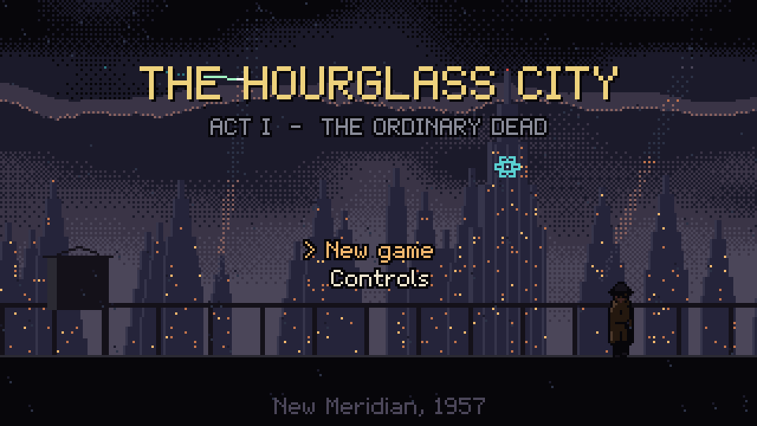
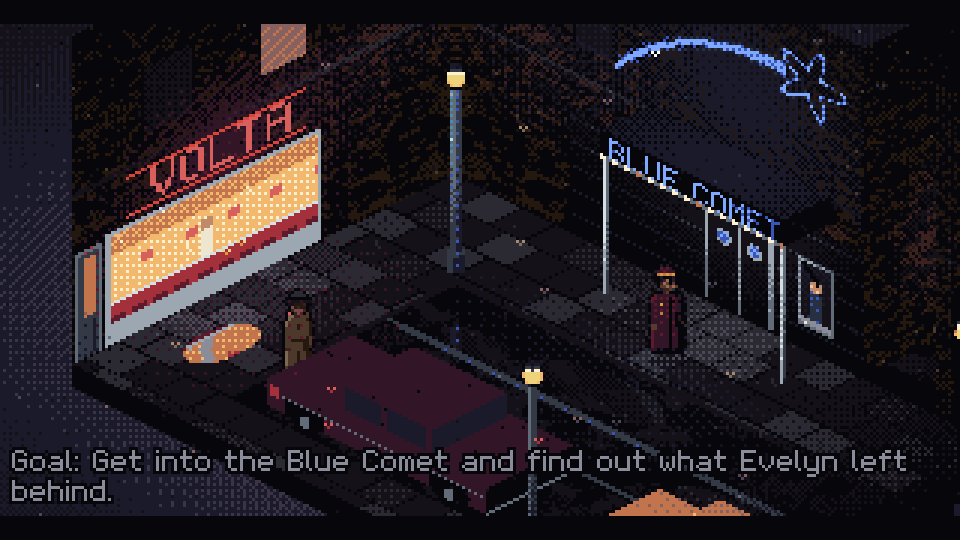
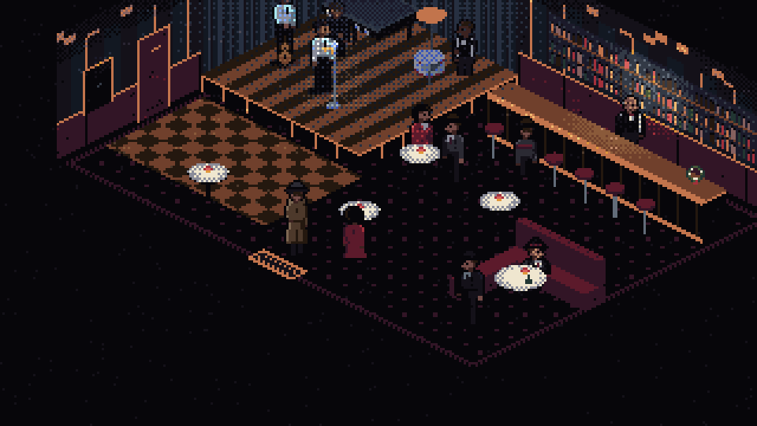
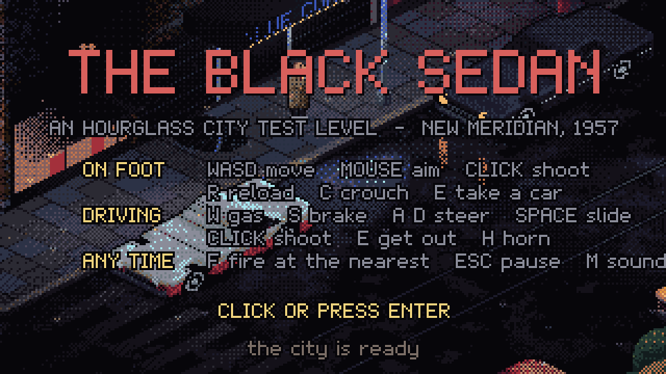
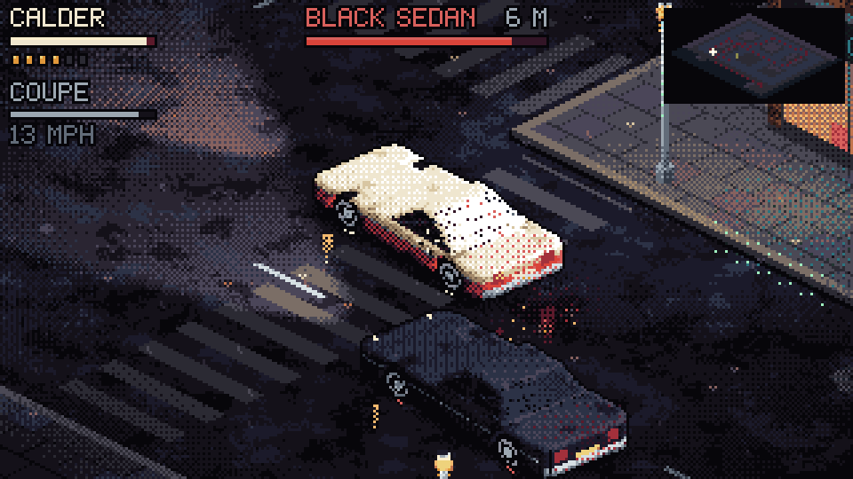
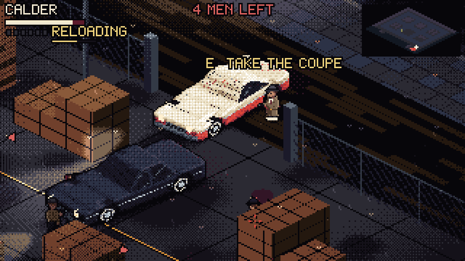
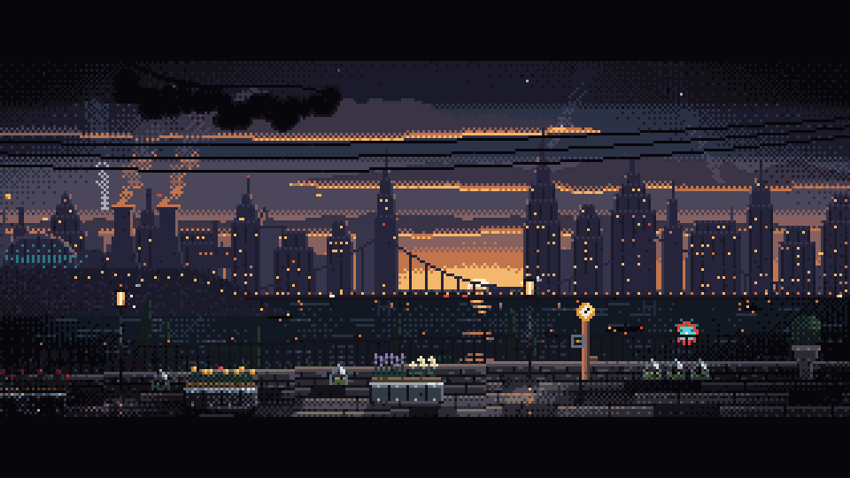

# PixelArtGameOpus

Noir pixel-art games in the browser. They are set in New Meridian in 1957 and follow detective Frank Calder.

Each game is a single self-contained HTML file. They use plain JavaScript and Canvas 2D, with no libraries, no image files and no audio files. Everything is drawn in code: every building, car, person, raindrop and letter of the font. The sound effects and music are synthesized at runtime.

| File | What it is |
|---|---|
| [`hourglass_city.html`](hourglass_city.html) | **The Hourglass City**, an isometric point-and-click adventure (Act I, *The Ordinary Dead*) |
| [`hourglass_testlevel.html`](hourglass_testlevel.html) | **The Black Sedan**, a real-time test level: take any car, chase the sedan, fight its crew at Pier 9 |
| [`ravenshore_garden.html`](ravenshore_garden.html) | **Ravenshore Garden**, a cinematic pixel-art loop |

## Play

**Play in your browser: https://odiriuss.github.io/PixelArtGameOpus/**

- [The Black Sedan](https://odiriuss.github.io/PixelArtGameOpus/hourglass_testlevel.html) (the car chase)
- [The Hourglass City](https://odiriuss.github.io/PixelArtGameOpus/hourglass_city.html) (the adventure)
- [Ravenshore Garden](https://odiriuss.github.io/PixelArtGameOpus/ravenshore_garden.html)

The games need a keyboard and mouse, so play them on a desktop or laptop. To play offline, download an HTML file and open it; you don't need to install anything or run a server.

## The Hourglass City



A 1950s detective adventure in the tradition of *Beneath a Steel Sky*. Frank's office, Ferrier Street, the Hotel Mirador, the Nickel Mile and the Blue Comet jazz club are all rendered in real time with lighting, rain and neon. Frank collects clues in his notebook and makes deductions from them.




**Mouse:** left click to walk, use, talk and pick up. Right click to look. Move to the top edge to open the inventory.
**Keyboard:** WASD or the arrow keys to walk, E or Space to use, Q to look, Tab for the next nearby thing, I for inventory, N for the notebook, 1–4 to pick dialogue, Esc for the menu.

The game saves at key moments, and you can also save from the Esc menu. *Continue* on the title screen resumes your game.

## The Black Sedan (test level)



A drive-by outside the Blue Comet starts a chase across the city.
- Take any parked car, or pull a driver out of a moving one. The sedan, coupe, taxi and delivery van all handle differently.
- Ram the sedan or shoot at it. Mind the streetcar and the harbour.
- The chase ends in a gunfight at Pier 9, or wherever you wreck their car. The crew use cover, flank you and pick their moments to shoot.




| | |
|---|---|
| On foot | WASD move, mouse aim, click to shoot, R reload, C crouch, E take a car |
| Driving | W gas, S brake/reverse, A/D steer, Space handbrake, click to shoot, E get out, H horn |
| Any time | F fire at the nearest target, Esc pause (R restarts the checkpoint), M sound |

Add these URL options to the file address: `?start=chase` or `?start=fight` jump to a checkpoint, `?god=1` makes Frank invincible, `?auto=1` lets a bot play it through, and `?debug=1` shows frame timings.

## Ravenshore Garden



A looping evening scene in a garden above the Ravenshore skyline. A woman waters the flower beds with her companion robot, and an aircar arrives at the end of the loop.

## Building from source

Each HTML file is built by concatenating its sources:

```sh
sh build.sh          # src/        -> hourglass_city.html
sh build_test.sh     # src/ (shared engine) + src_test/ -> hourglass_testlevel.html
sh build_garden.sh   # src_garden/ -> ravenshore_garden.html
```

The test level reuses the adventure's engine: the rasteriser, lighting, characters, audio and effects in `src/01–12`. It adds its own city, voxel cars, driving physics, AI drivers, gunplay and goon AI in `src_test/`.

## Tests

The headless browser tests use [puppeteer-core](https://pptr.dev/) with an installed Chrome. If Chrome is not at the default Windows path, set `CHROME_PATH` to it.

```sh
npm install
npm test              # everything
npm run test:city     # both story routes, keyboard play with save and load, room exits and entrances
npm run test:level    # bot playthrough of the chase and fight, interactions, menus, the streetcar
```

`node tools/tl.js tests/<file>.json` runs a single test of the test level, and `node tools/run.js tests/<file>.json` does the same for the adventure. Screenshots are written to `shots/`.

## Credits

The story, characters and setting are adapted from the *Ravenshore Hourglass* concept pack. The games were written with [Claude Code](https://claude.com/claude-code) (Claude Opus 5.5).
